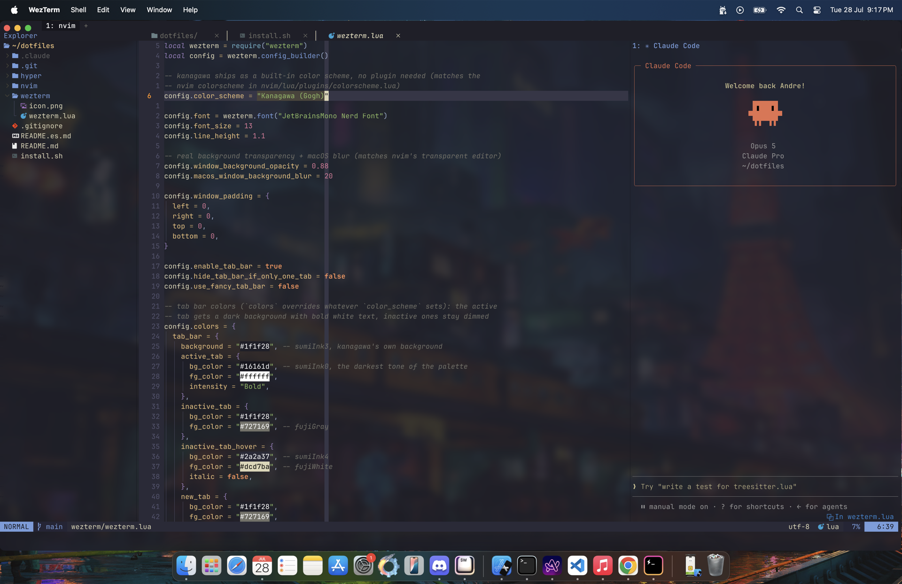

# dotfiles


[English](README.md)

Un entorno de desarrollo portable para macOS, reproducible en cualquier
máquina con un solo comando: Neovim configurado como IDE completo, WezTerm
como terminal, y Claude Code integrado de forma nativa. Todo con el tema
[Kanagawa](https://github.com/rebelot/kanagawa.nvim) (Wave).



## Contenido

- **`nvim/`** — Neovim como IDE: LSP (TypeScript/JS, Python, Lua, JSON, HTML, CSS, Bash, Markdown), autocompletado, Treesitter, explorador de archivos, fuzzy finder, git signs, formateo automático al guardar, tema Kanagawa con cursor en cruz, y [claudecode.nvim](https://github.com/coder/claudecode.nvim) para usar Claude Code directamente dentro del editor.
- **`wezterm/`** — Terminal principal. Acelerada por GPU, configurada en Lua, tema Kanagawa nativo con la pestaña activa resaltada, transparencia real con blur.
- **`hyper/`** — Config de [Hyper](https://hyper.is), usada al principio. Queda de respaldo pero ya no es la terminal recomendada: al ser Electron, muestra su propio menú contextual nativo, que choca con el de Neovim (doble menú al hacer click derecho).

## Instalación

```bash
git clone https://github.com/andre-subia/dotfiles.git ~/dotfiles
~/dotfiles/install.sh
```

Esto instala todas las dependencias (vía Homebrew), la fuente, el CLI de
Claude Code si falta, y crea los symlinks. Se puede correr de nuevo sin
problema — no reinstala lo que ya está, y si encuentra un `~/.config/nvim` o
`~/.hyper.js` previo que no sea de este repo, lo mueve a un `.bak` en vez de
pisarlo.

Después, abrí WezTerm y corré `nvim` una vez (lazy.nvim instala los plugins
solo en el primer arranque).

## Atajos de Neovim

Leader = `<space>`. Cheatsheet completo en [`nvim/README.es.md`](nvim/README.es.md).

¿Primera vez con Neovim? [`nvim/TUTORIAL.es.md`](nvim/TUTORIAL.es.md) tiene la
tabla de equivalencias con Mac/VS Code (`Cmd+Z`, `Cmd+P`, etc.) y una intro a
los modos.

## Claude Code dentro de Neovim

Usa [claudecode.nvim](https://github.com/coder/claudecode.nvim), que
implementa el mismo protocolo (WebSocket MCP) que la extensión oficial de VS
Code: Claude ve el buffer activo, la selección y los diagnósticos en tiempo
real, y puede proponer diffs que se revisan nativamente en Neovim.

Requiere tener el [Claude Code CLI](https://docs.anthropic.com/en/docs/claude-code)
instalado y accesible como `claude` en el `PATH`. Corré `:checkhealth
claudecode` dentro de Neovim para verificar la instalación.
